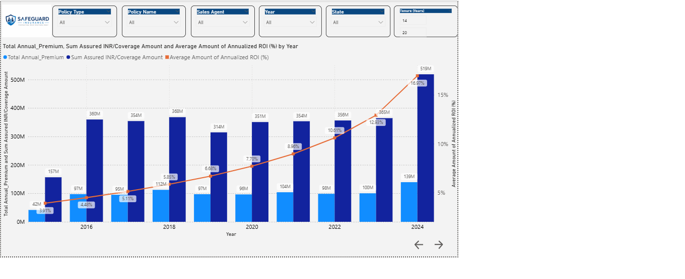
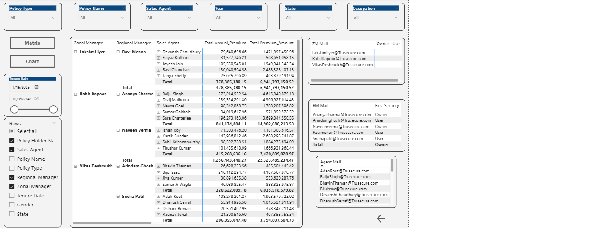

# 🏥 Insurance Premium & Payout KPI Dashboard | Power BI


---

## 📌 Project Overview

An end-to-end **Power BI Finance Dashboard** built to analyze Insurance Premium collections, Payout trends, and Agent performance across multiple states and policy types.

This project simulates a real-world BI analyst role in the **Insurance/Finance domain** — from raw data ingestion to executive-ready KPI dashboards.

---

## 🎯 Business Problem

Insurance companies need to track premium collections vs. actual payouts to manage risk and profitability. This dashboard answers:
- Are premiums collected covering the payouts made?
- Which states/agents/policies are underperforming?
- What is the yearly growth rate of premiums vs. expenses?

---

## 📊 Dashboard Pages & Features

| Page | Description |
|---|---|
| **KPI Overview** | Total Premiums Paid, Payable, Amount vs. Underwriting Expenses |
| **State-wise Analysis** | Geographic performance breakdown |
| **Policy Analysis** | Policy-type contribution to revenue |
| **Agent Performance** | Individual sales agent contribution |
| **Trend Analysis** | Yearly Growth Rate & ROI trends |

---

## 🛠️ Tools & Technologies

| Tool | Usage |
|---|---|
| **Power BI Desktop** | Dashboard design & publishing |
| **DAX** | Advanced KPI calculations |
| **Power Query (M)** | Data transformation & cleaning |
| **Excel** | Source data |
| **Data Modeling** | Star schema relationships |
| **Row-Level Security (RLS)** | Role-based data access control |

---

## 💡 Key Technical Skills Demonstrated

- ⚡ **Advanced DAX** — Annual Growth Rate, ROI, Running Totals, YOY comparisons
- 🗂️ **Star Schema Modeling** — Fact & Dimension table relationships
- 🔐 **Row-Level Security (RLS)** — State/region-level access control
- 📐 **KPI Card Design** — Dynamic measures with conditional formatting
- 🔍 **Drill-Through Reports** — Interactive page navigation

---

## 📸 Dashboard Screenshots



.png)


---

## 📂 Repository Structure

```
📦 Insurance-Premium-and-Payout-KPI-Dashboard
 ┣ 📁 data/              → Raw Excel dataset
 ┣ 📁 powerbi/           → .pbix Power BI project file
 ┣ 📁 screenshots/       → Dashboard preview images
 ┗ 📄 README.md          → Project documentation
```

---

## 🚀 How to Run This Project

1. Download the `.pbix` file from the `powerbi/` folder
2. Open with **Power BI Desktop** (free download from Microsoft)
3. If needed, reconnect the data source to the Excel file in `data/`
4. Explore all dashboard pages and RLS roles

---

## 📈 Key Insights from the Dashboard

- *(Add 2–3 real insights you found from your data — e.g., "State X had the highest premium growth of Y%")*
- *(e.g., "Agent category A contributed 45% of total premium collections")*
- *(e.g., "Underwriting expenses grew 12% YOY while premium revenue grew 18%")*

---

## 👤 Author

**Naveen** — Aspiring Data Analyst | Power BI | SQL | Excel  
📎 [LinkedIn Profile](https://www.linkedin.com/in/naveenkumar-k-643017405?utm_source=share_via&utm_content=profile&utm_medium=member_ios)  
📁 [GitHub Portfolio](https://github.com/naveenupward)
